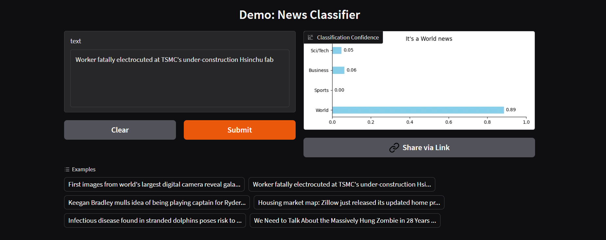

# AGNews-BERT: BERT-based News Text Classifier

[](https://www.python.org/)
[](https://pytorch.org/)
[](https://huggingface.co/transformers/)


This project is a news text classification system leveraging the **Hugging Face Transformers library** to fine-tune a **DistilBERT** pre-trained model on the AG News dataset. Its core objective is to accurately and automatically categorize news articles into four distinct classes: **World, Sports, Business, and Sci/Tech.**

It showcases the application of state-of-the-art pre-trained deep learning models to a practical Natural Language Processing (NLP) classification task, achieving high accuracy in news categorization.

## Key Features

* **DistilBERT-powered Classification:** Utilizes an advanced Transformer architecture for robust text understanding and categorization.

* **Four-Category News Classification:** Precisely classifies news articles into World, Sports, Business, and Sci/Tech categories.
* **End-to-End Training Pipeline:** Includes data preprocessing, model fine-tuning, evaluation, and saving.
* **Clean and Modular Codebase:** Designed for readability, maintainability, and extensibility.
* **Interactive Demo Interface:** Provides a user-friendly web interface for real-time news classification (if applicable).
* **High Performance:** Achieves **94.2%** classification accuracy and F1-score on the AG News test set.

## Demo

This project is also developed to my Hugging Face space. Experience the live demo of this project at [AG-News-Demo](https://huggingface.co/spaces/AmeHibiki/AG-News-Demo).



## Dataset
This project utilizes the **AG News dataset**, a widely used public dataset of news articles for text classification research. It comprises 120,000 training samples and 7,600 test samples across four categories.
* World News

* Sports News
* Business News
* Sci/Tech News

Dataset link: [fancyzhx/ag_news](https://huggingface.co/datasets/fancyzhx/ag_news)
```
@inproceedings{Zhang2015CharacterlevelCN,
  title={Character-level Convolutional Networks for Text Classification},
  author={Xiang Zhang and Junbo Jake Zhao and Yann LeCun},
  booktitle={NIPS},
  year={2015}
}
```